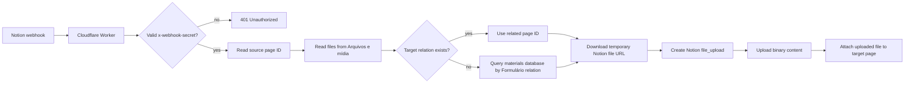

# notion-file-actions

> A small Cloudflare Worker that listens to Notion webhook events, downloads files from a source Notion page, uploads them back through Notion’s File Upload API, and attaches them to the related target page.


## Why this exists

Notion file properties cannot be moved between different pages or databases simply by copying the file object with Notion's UI automation. CAECOMP's review-to-materials workflow is a clear example of this limitation, so we built this Worker to solve it.

Also, Notion file properties may expose temporary signed URLs. Those URLs are useful for downloading the file, but they are not always suitable as stable `external_url` references when creating or updating Notion content.

`notion-file-actions` solves that by acting as a small automation layer:

1. receive a Notion webhook payload;
2. validate the webhook with a shared secret;
3. read files from a source page property;
4. resolve the destination page;
5. download each temporary Notion file URL;
6. upload the binary content through Notion’s direct file upload flow;
7. attach the uploaded file to the target page.

In short: it turns “file uploaded in one Notion page” into “file safely re-attached to the related Notion page.”

---

## Current use case

This Worker is currently shaped around a Notion workspace that uses Portuguese property names:

| Concept | Expected name |
|---|---|
| Source file property | `Arquivos e mídia` |
| Direct target relation | `📝 Materiais de Estudo` |
| Fallback relation from target database | `Formulário` |
| Target file property | `Arquivos e mídia` |

The automation first tries to find the target page through the `📝 Materiais de Estudo` relation in the webhook payload.

If that relation is missing, it falls back to querying the configured materials database and finds the most recent page whose `Formulário` relation points back to the source page.

---

## Architecture



---

## Tech stack

- **Runtime:** Cloudflare Workers
- **Framework:** Hono
- **Language:** TypeScript
- **Notion SDK:** `@notionhq/client`
- **Local/dev tooling:** Wrangler
- **Tests:** Vitest + Cloudflare Workers test pool

---

## Project structure

```txt
.
├── src
│   ├── index.ts              # Worker entrypoint and webhook route
│   ├── notion
│   │   └── upload.ts         # Notion direct file upload helper
│   └── types.ts              # Minimal webhook file type
├── test
│   └── index.spec.ts         # Starter Worker test scaffold
├── package.json
├── tsconfig.json
├── wrangler.jsonc
└── worker-configuration.d.ts # Generated Cloudflare Worker types
```

---

## Requirements

Before running this Worker, you need:

- a Cloudflare account;
- Node.js and pnpm;
- Wrangler authenticated with your Cloudflare account;
- a Notion integration token;
- the relevant Notion database/pages shared with your integration;
- a webhook source capable of sending the expected Notion payload shape.

---

## Environment variables

The Worker expects three secrets:

| Name | Required | Description |
|---|---:|---|
| `WEBHOOK_SECRET` | Yes | Shared secret expected in the `x-webhook-secret` request header. |
| `NOTION_API_KEY` | Yes | Internal integration token from Notion. |
| `NOTION_ROOT_PAGE_ID` | Yes | ID of the Notion database/page used for fallback target lookup. |

For local development, create a `.dev.vars` file:

```env
WEBHOOK_SECRET=replace-with-a-long-random-secret
NOTION_API_KEY=secret_xxxxxxxxxxxxxxxxxxxxxxxxxxxxxxxxx
NOTION_ROOT_PAGE_ID=xxxxxxxxxxxxxxxxxxxxxxxxxxxxxxxx
```

Do not commit `.dev.vars`.

For production, store them as Cloudflare Worker secrets:

```bash
npx wrangler secret put WEBHOOK_SECRET
npx wrangler secret put NOTION_API_KEY
npx wrangler secret put NOTION_ROOT_PAGE_ID
```

---

## Installation

```bash
git clone https://github.com/vmenezesdev/notion-file-actions.git
cd notion-file-actions
pnpm install
```

---

## Local development

Start the Worker locally:

```bash
pnpm run dev
```

By default, Wrangler serves the Worker at:

```txt
http://localhost:8787
```

---

## Webhook contract

### Endpoint

```http
POST /
```

### Required header

```http
x-webhook-secret: your-shared-secret
```

### Expected payload shape

The implementation expects a payload with `data.id` and Notion-like page properties:

```json
{
  "data": {
    "id": "source-page-id",
    "properties": {
      "Arquivos e mídia": {
        "files": [
          {
            "name": "example.pdf",
            "type": "file",
            "file": {
              "url": "https://temporary-notion-file-url"
            }
          }
        ]
      },
      "📝 Materiais de Estudo": {
        "relation": [
          {
            "id": "target-page-id"
          }
        ]
      }
    }
  }
}
```

### Example request

```bash
curl -X POST "http://localhost:8787/" \
  -H "content-type: application/json" \
  -H "x-webhook-secret: $WEBHOOK_SECRET" \
  -d '{
    "data": {
      "id": "source-page-id",
      "properties": {
        "Arquivos e mídia": {
          "files": [
            {
              "name": "example.pdf",
              "type": "file",
              "file": {
                "url": "https://temporary-notion-file-url"
              }
            }
          ]
        },
        "📝 Materiais de Estudo": {
          "relation": [
            {
              "id": "target-page-id"
            }
          ]
        }
      }
    }
  }'
```

---

## How target resolution works

The Worker resolves the target page in two steps.

### 1. Direct relation

If the source page has files and the `📝 Materiais de Estudo` relation is present, the Worker uses the first related page as the target.

```txt
source page
└── 📝 Materiais de Estudo
    └── target page
```

### 2. Fallback database lookup

If the direct relation is missing, the Worker queries the configured Notion data source and looks for the most recent page whose `Formulário` relation contains the source page ID.

```txt
materials database
└── page where Formulário contains source page ID
    └── target page
```

This makes the automation more resilient when the webhook payload does not include the relation needed to resolve the destination directly.

---

## How file upload works

For each file in `Arquivos e mídia`, the Worker:

1. downloads the file from the temporary Notion URL;
2. detects the content type from the file extension;
3. creates a Notion `file_upload` object;
4. sends the binary content as `multipart/form-data`;
5. receives a `file_upload.id`;
6. updates the target page file property with the uploaded file.

Supported MIME type detection currently includes common formats such as:

- PDF;
- Word, Excel and PowerPoint files;
- PNG, JPG, GIF and SVG;
- TXT, Markdown, CSV, HTML, JSON and XML;
- ZIP;
- MP4 and MP3.

Unknown extensions fall back to:

```txt
application/octet-stream
```

---

## Rate limiting

The Worker includes a simple Notion API rate limiter.

It targets **2 requests per second** to stay below Notion’s commonly enforced request limits and reduce avoidable failures during file upload and page update operations.

---

## Deployment

Deploy to Cloudflare Workers:

```bash
pnpm run deploy
```

The Worker name is configured in `wrangler.jsonc` as:

```txt
notion-file-actions
```

---

## Type generation

After changing Cloudflare bindings, regenerate Worker types:

```bash
pnpm run cf-typegen
```

This updates `worker-configuration.d.ts`.

---

## Testing

Run the test suite:

```bash
pnpm test
```

### Current testing note

The existing test file is still close to the default Cloudflare Worker starter test. Before relying on it as a quality gate, it should be updated to cover the real webhook behavior:

- unauthorized requests;
- missing `data.id`;
- missing file property;
- direct target relation;
- fallback target lookup;
- Notion upload failures;
- target page update failures.

---

## Troubleshooting

### `401 Unauthorized`

The request is missing `x-webhook-secret` or the value does not match `WEBHOOK_SECRET`.

Check:

```bash
npx wrangler secret put WEBHOOK_SECRET
```

And confirm the sender is passing:

```http
x-webhook-secret: your-shared-secret
```

---

### `Source page ID not found in webhook payload`

The payload does not contain:

```txt
data.id
```

Check the webhook event shape and make sure the source page ID is available at that path.

---

### `Materials database page ID misconfigured`

`NOTION_ROOT_PAGE_ID` is missing or empty.

Set it locally in `.dev.vars` or in production through Wrangler secrets.

---

### `Could not retrieve datasource`

The configured Notion root page/database could not be resolved into a data source.

Check that:

- the ID is correct;
- the Notion integration has access to the database;
- the database has been shared with the integration.

---

### `Target page ID not found in webhook payload`

The Worker could not find a target page through either strategy:

1. direct `📝 Materiais de Estudo` relation;
2. fallback database query by `Formulário`.

Check that your Notion schema matches the expected property names and relation structure.

---

### `Failed to download file from Notion URL`

The temporary file URL may have expired, or the Worker may not be able to fetch it.

Retry the event while the Notion file URL is still valid.

---

### `Failed to create file upload`

Usually related to Notion API authentication, request shape, API version, or integration permissions.

Check:

- `NOTION_API_KEY`;
- Notion integration permissions;
- whether the integration has access to the target workspace/page.

---

### Files are uploaded but not visible on the target page

Check that the target page has a file property named exactly:

```txt
Arquivos e mídia
```

Property names are currently hard-coded.

---

## Security notes

This Worker handles sensitive data: Notion API tokens, temporary file URLs and uploaded file content.

Recommended practices:

- use a long random `WEBHOOK_SECRET`;
- store secrets only through Wrangler or `.dev.vars`;
- never commit `.dev.vars`;
- share only the required Notion pages/databases with the integration;
- rotate the Notion token if it is exposed;
- avoid logging full file URLs in production;
- consider adding origin/IP checks if the webhook sender is predictable;
- consider returning structured error IDs instead of raw internal errors.

---

## Known limitations

This is a focused automation, not a general-purpose Notion sync engine.

Current limitations:

- property names are hard-coded;
- only one direct relation target is used;
- the target file property update may need refinement if you want to preserve existing files instead of replacing the property value;
- file size validation should be enforced before upload;
- retries and backoff are not yet implemented;
- tests need to be aligned with the current webhook behavior;
- response body is still minimal and should become structured JSON.

---

## Roadmap

Potential next improvements:

- [ ] Return structured JSON responses for success and failure cases.
- [ ] Preserve existing files on the target page before appending new ones.
- [ ] Add idempotency to avoid duplicate uploads.
- [ ] Move Notion property names to environment/config.
- [ ] Add typed webhook payload validation.
- [ ] Add integration tests with mocked Notion API responses.
- [ ] Add retry/backoff for transient Notion or network failures.
- [ ] Add safer production logs with correlation IDs.
- [ ] Add a small deployment guide for Notion + Cloudflare setup.
- [ ] Add examples for multiple database schemas.

---

## Contributing

Contributions should keep the Worker small, explicit and operationally safe.

Good first contributions:

- improve tests;
- improve error responses;
- extract hard-coded Notion property names into config;
- add examples;
- document new Notion schemas;
- improve upload edge-case handling.

Before opening a pull request:

```bash
pnpm install
pnpm test
pnpm run cf-typegen
```

---

## Author

Built by [Vinícius Menezes](https://github.com/vmenezesdev).

---

## License

This project is licensed under the MIT License — see [LICENSE](LICENSE) for details.